<div align="center">


# Patrata (पात्रता)

**Explainable loan pre-screening for Indian borrowers and lenders.**
Know where you stand before you apply. Know why a case needs a human before you review it.

[](https://patrata-loan-screener.netlify.app)
[](https://patrata.onrender.com/docs)
[](https://github.com/kritikab01/patrata-app/actions/workflows/ci.yml)
[](LICENSE)


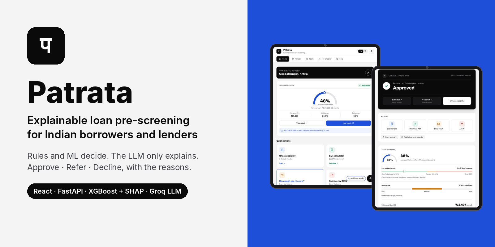

**[Open the live app](https://patrata-loan-screener.netlify.app)** ·
**[Lender desk](https://patrata-loan-screener.netlify.app/?mode=desk&tab=dashboard)** (any 4-digit PIN, e.g. `1234`) ·
**[Product requirements (PRD)](docs/PRD.md)** ·
**[Decision log](docs/DECISIONS.md)** ·
**[Engine repo](https://github.com/kritikab01/patrata)** ·
**Demo video:** _coming soon_

</div>

> [!NOTE]
> Version 1 was built as my end-term project for **AI for Managers: Applications and Strategy** at FORE School of Management.
> It is a working product, not a mock-up, and the [roadmap](#roadmap) shows how it grows into v2 and v3.
> **Decision support only.** Patrata is not a lender and does not give financial advice. A credit officer makes every final call.

> [!TIP]
> The engine runs on Render's free plan and sleeps after 15 minutes. The first check of the day can take about a minute while it wakes up.

---

## Contents

- [The problem](#the-problem)
- [Who it is for](#who-it-is-for)
- [What makes it different](#what-makes-it-different)
- [How a decision is made](#how-a-decision-is-made)
- [Borrower app](#borrower-app)
- [Lender desk](#lender-desk)
- [Responsible AI and guardrails](#responsible-ai-and-guardrails)
- [Models and data](#models-and-data)
- [Tech stack](#tech-stack)
- [How it was built](#how-it-was-built)
- [Product thinking](#product-thinking)
- [Roadmap](#roadmap)
- [Run it locally](#run-it-locally)
- [Project structure](#project-structure)
- [Known limitations](#known-limitations)
- [Author](#author)

---

## The problem

Getting a loan in India is a black box for most first-time borrowers.

| Who | Pain today |
|---|---|
| **Borrower** | Applies without knowing if they qualify. Every rejected application adds a hard enquiry that pulls the CIBIL score down, and the rejection rarely says *why* or *what to change*. |
| **Credit officer** | Spends review time on files that fail basic policy anyway, and gets little help on the borderline cases that actually need judgement. |
| **Lender (NBFC / bank)** | Needs speed, but RBI's digital lending rules and the DPDP Act also demand transparency, minimal data, consent and a human in the loop. |

**Patrata's job:** a two-minute, no-PAN, no-Aadhaar pre-screen that gives **Approved / Referred / Declined** with the reasons and the smallest change that would help, plus a lender desk where officers spend their time only on the cases that need a person.

## Who it is for

| Persona | Goal | What Patrata gives them |
|---|---|---|
| **Riya, 26, first salaried job** (end user) | "Will I get a ₹5 lakh personal loan, and what EMI can I afford?" | Free check in Hindi or English, no hard enquiry, clear reasons, EMI and real-cost (APR) maths, a slip to take to the bank |
| **Arjun, credit officer at an NBFC** (end user) | Clear the queue fast without missing risk | Review queue with reasons, a Review Agent that drafts a memo, batch screening, side-by-side compare |
| **Credit / risk head** (buyer) | Faster turnaround, fewer bad loans, audit-ready decisions | Dashboard, audit log of every decision and override, model card, fairness check |

The **borrower uses it free**; the **paying customer is the lender** (or a loan marketplace that embeds it). See the [PRD](docs/PRD.md#9-business-model) for the business model.

## What makes it different

| | Loan marketplaces (e.g. Paisabazaar) | Lender rule engines (e.g. FinBox Sentinel) | **Patrata** |
|---|---|---|---|
| Who it serves | Borrower | Lender back office | **Both, from one engine** |
| Needs PAN / bureau pull to start | Yes | Yes | **No** (self-declared pre-screen) |
| Explains *each rule* with value vs benchmark | No | Internal only | **Yes, in plain English and Hindi** |
| Tells you what to change | Rarely | No | **Yes** ("a 4-year tenure clears every check") |
| AI explanation with guardrails | n/a | n/a | **LLM explains, never decides; numbers verified** |
| Human-in-the-loop desk with audit trail | n/a | Yes | **Yes, with a Review Agent and written reasons** |

## How a decision is made

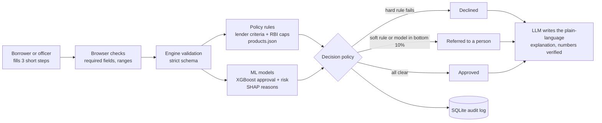
```mermaid
flowchart LR
    A[Borrower or officer<br/>fills 3 short steps] --> B[Browser checks<br/>required fields, ranges]
    B --> C[Engine validation<br/>strict schema]
    C --> D[Policy rules<br/>lender criteria + RBI caps<br/>products.json]
    C --> E[ML models<br/>XGBoost approval + risk<br/>SHAP reasons]
    D --> F{Decision policy}
    E --> F
    F -->|hard rule fails| G[Declined]
    F -->|soft rule or model in bottom 10%| H[Referred to a person]
    F -->|all clear| I[Approved]
    F --> J[(SQLite audit log)]
    G & H & I --> K[LLM writes the plain-language<br/>explanation, numbers verified]
```

**The one design rule:** *rules and models decide, the LLM only explains.*
The model can never decline on its own (at worst it sends a case to a person), and the LLM is called only after the decision is locked.

<details>
<summary>System architecture (image)</summary>

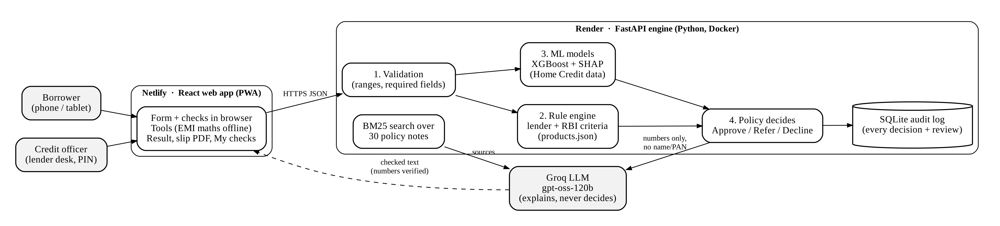
</details>

## Borrower app

<table>
<tr>
<td width="33%" align="center">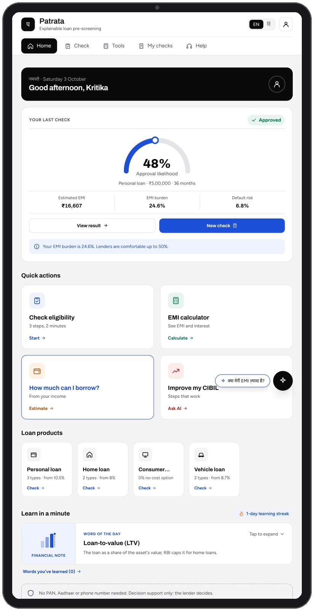<br/><sub><b>Home:</b> greeting, last check, word of the day</sub></td>
<td width="33%" align="center">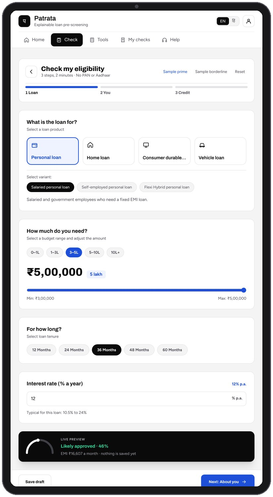<br/><sub><b>Check:</b> 3 steps with a live preview</sub></td>
<td width="33%" align="center">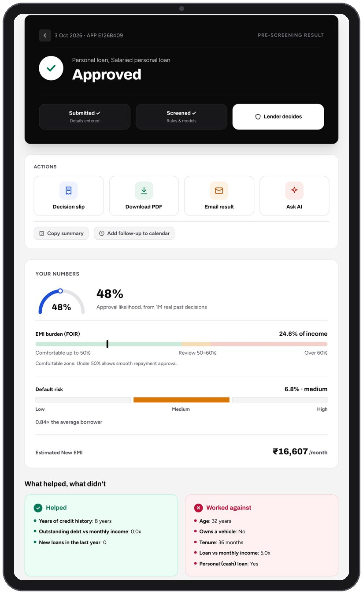<br/><sub><b>Result:</b> verdict, likelihood, EMI burden, reasons</sub></td>
</tr>
<tr>
<td align="center">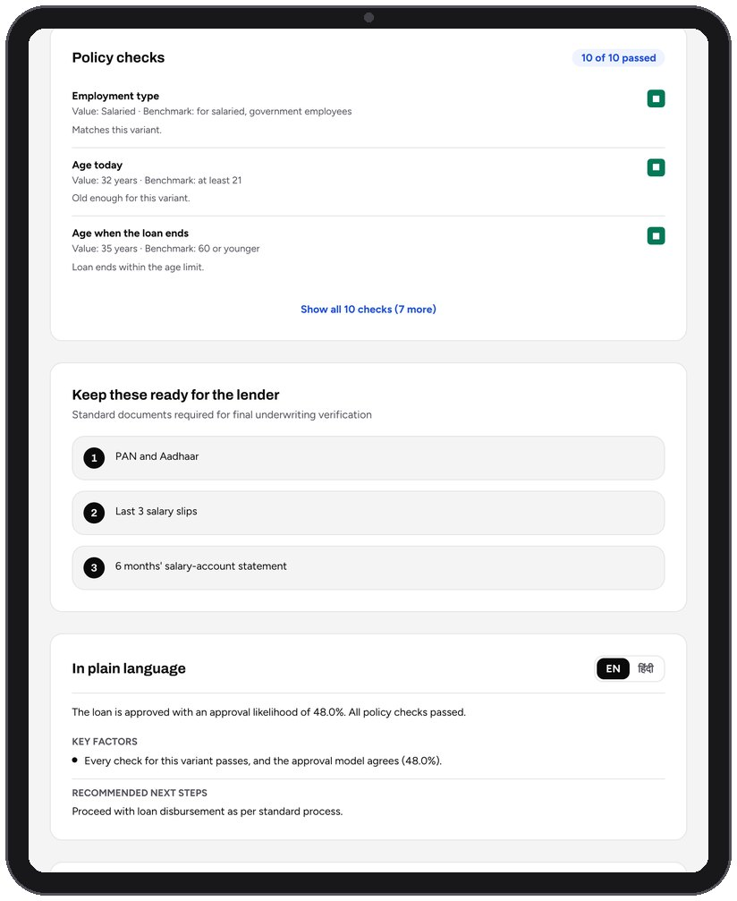<br/><sub><b>Every rule</b> with value vs benchmark</sub></td>
<td align="center">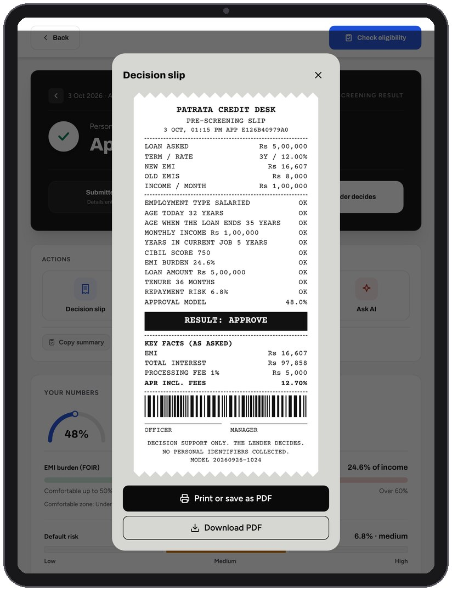<br/><sub><b>Decision slip:</b> print or PDF, KFS-style costs</sub></td>
<td align="center">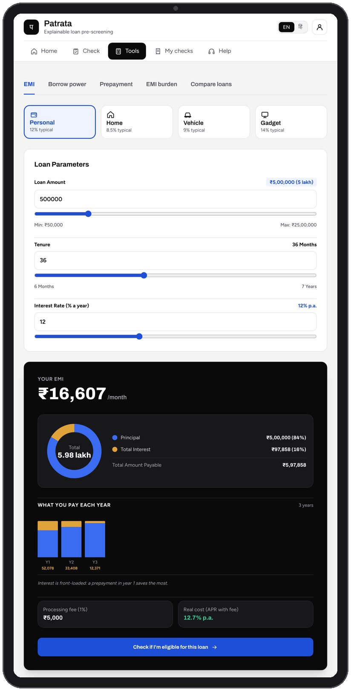<br/><sub><b>Tools:</b> EMI, borrow power, prepayment (work offline)</sub></td>
</tr>
<tr>
<td align="center">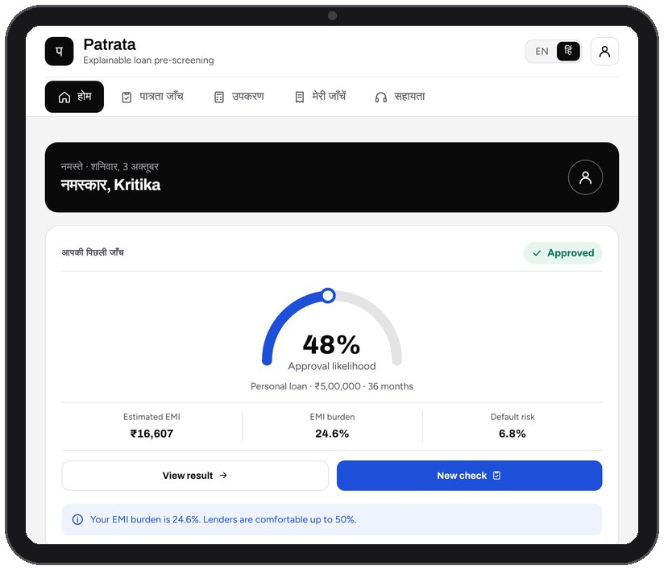<br/><sub><b>English / हिंदी</b> in one tap</sub></td>
<td align="center">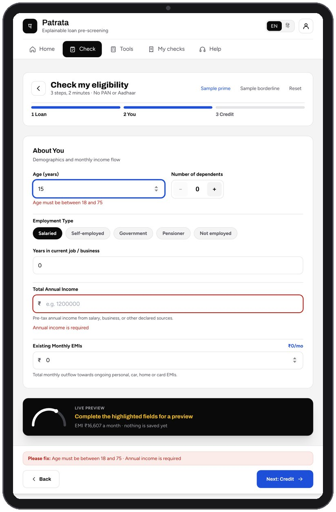<br/><sub><b>Validation:</b> clear messages, nothing sent until valid</sub></td>
<td align="center">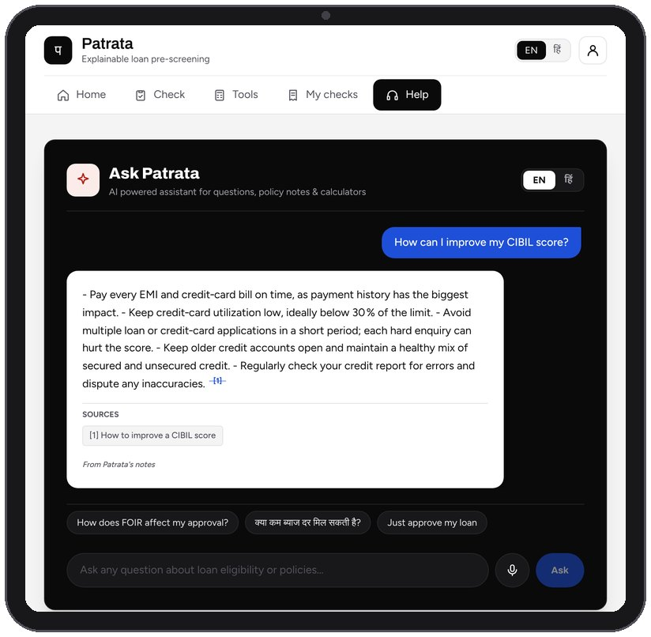<br/><sub><b>Ask Patrata:</b> answers with visible sources</sub></td>
</tr>
</table>

- **No login, no PAN, no Aadhaar.** Only a first name, kept on the device.
- **Consent first:** the borrower is told a summary goes to a third-party AI before anything is scored.
- **My checks:** history saved on the phone, with filters, reopen and clear.
- **Help:** FAQ, report an issue, and a grievance officer with the RBI Integrated Ombudsman link.
- **Installable PWA:** add to the home screen on Android or iPhone.

## Lender desk

<table>
<tr>
<td width="50%" align="center">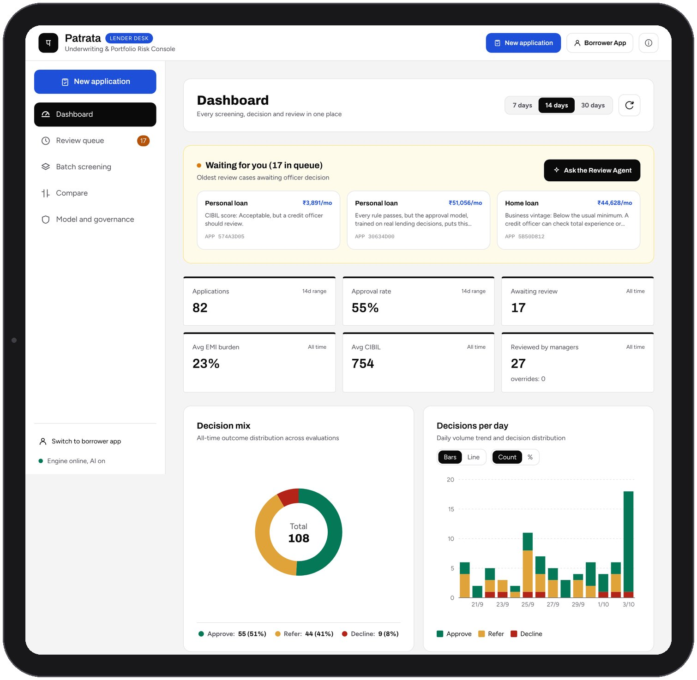<br/><sub><b>Dashboard:</b> queue, KPIs, decision mix, decisions per day</sub></td>
<td width="50%" align="center">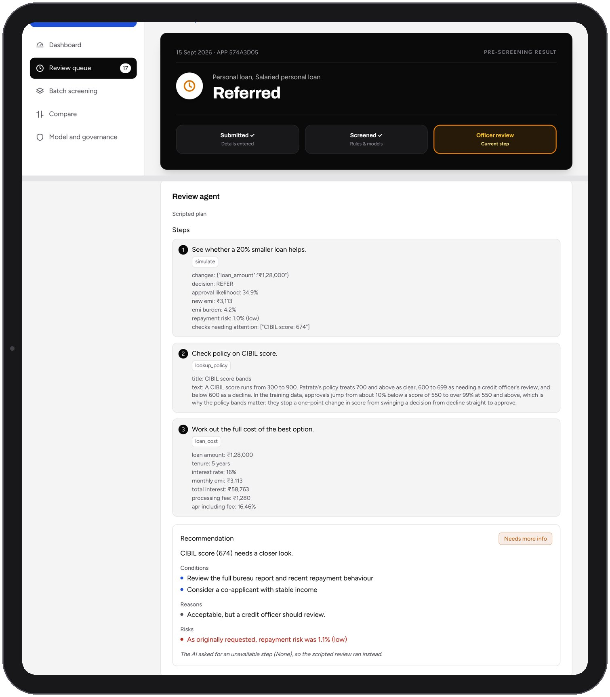<br/><sub><b>Review Agent:</b> plans tool calls, drafts a memo, a person decides</sub></td>
</tr>
<tr>
<td align="center">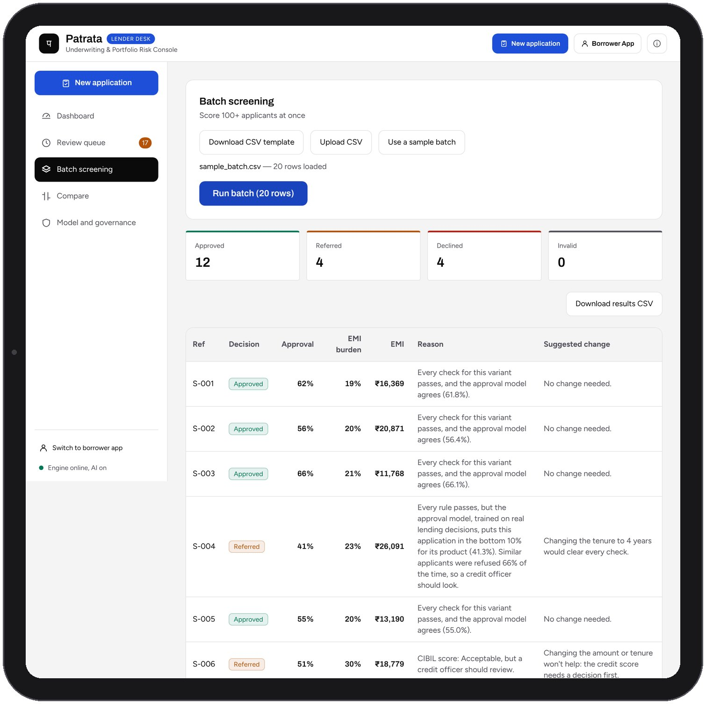<br/><sub><b>Batch screening:</b> CSV in, reasons and suggested changes out</sub></td>
<td align="center">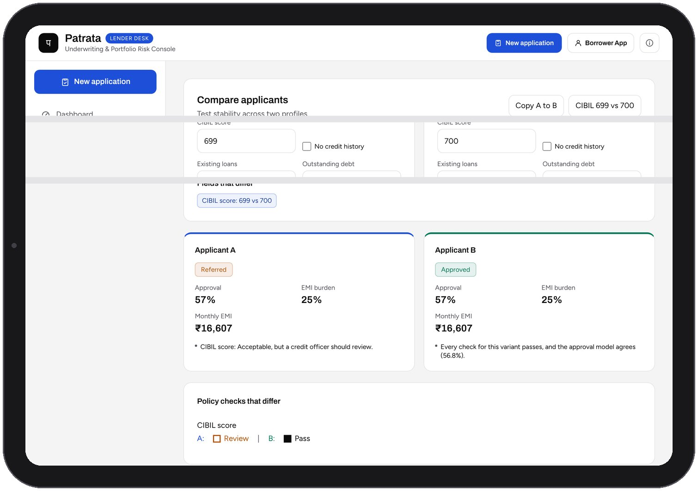<br/><sub><b>Compare:</b> CIBIL 699 vs 700, see exactly what flips</sub></td>
</tr>
</table>

- **PIN-gated desk** (demo PIN: any 4 digits), with a server-side desk key for the review endpoint.
- **Review queue:** every Referred case; the officer must pick Approve/Decline, write a reason (10+ characters) and sign, and it is audited.
- **Model and governance page:** decision flow, model metrics vs baselines, what data reaches the LLM, retrieval accuracy, thresholds, limitations.

## Responsible AI and guardrails

| Risk | Guardrail |
|---|---|
| LLM "decides" or promises a loan | Decision is computed **before** the LLM is called; out-of-scope asks ("can you just approve it?") get a fixed refusal |
| LLM invents numbers | Every number in the AI text is checked against the engine's numbers; any mismatch → deterministic template |
| Prompt injection | Pattern guard before the model; off-topic requests get a polite scoped reply |
| Personal data leaks to a third party | LLM receives derived figures and rule results only; no name, PAN, phone or address is ever collected |
| Model cliff effects | 600–699 CIBIL band goes to **Refer**, not Decline, so a one-point change cannot flip Decline ↔ Approve |
| Weak model forces a bad outcome | The model can only send a case to a person; it never declines alone |
| AI service down or slow | Template explanation, scripted Review Agent fallback, offline calculators |
| Double submit / refresh | Idempotent `request_id`; result ID in the URL; drafts saved locally |

## Models and data

| Model | Data | Result |
|---|---|---|
| Approval model v2 (XGBoost) | 1,046,997 real past loan decisions (Home Credit Default Risk) | ROC-AUC **0.756** vs 0.748 logistic-regression baseline |
| Repayment-risk model v2 (XGBoost) | 307,499 loans + 1,716,428 credit-bureau records | ROC-AUC **0.661** (used only to trigger a review) |
| Policy assistant (BM25 RAG) | 30 written policy notes | **25 / 25** top-1 retrieval on a test set |
| Fairness check | Approval rate by gender | 80.7% women vs 81.2% men |

Full details live in the engine repo: [DATA_AND_MODEL.md](https://github.com/kritikab01/patrata/blob/main/docs/DATA_AND_MODEL.md).

## Tech stack

| Layer | Choice | Why |
|---|---|---|
| Front end (this repo) | React 18, TypeScript, Vite, Tailwind CSS, Recharts, jsPDF + html2canvas | Fast, typed, mobile-first; charts and a printable slip |
| App type | Progressive Web App (manifest + service worker) | Installs like an app, no app store |
| Hosting | **Netlify**, auto-deploy from `main` | Free, instant deploys and PR previews |
| Engine ([patrata](https://github.com/kritikab01/patrata)) | Python, **FastAPI**, Docker on **Render** | Exact, testable decision logic; free API docs at `/docs` |
| Rules | Product book `products.json`: 4 products, 9 variants | Lender rules are data, so cut-offs change without code |
| ML | XGBoost + SHAP | Strong on tabular data; per-decision reasons |
| LLM | Groq-hosted open-weight model (GPT-OSS 120B / Llama 3.3 70B with automatic fallback) | Free tier, ~1 s replies, could be self-hosted in India later |
| Storage | SQLite audit log (engine); `localStorage` for the borrower's own history | Every decision and review is recorded |
| Quality | 83 engine tests (pytest), TypeScript checks and a build on every push (GitHub Actions) | Catch mistakes before users do |

## How it was built

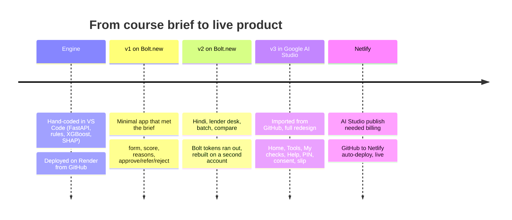
```mermaid
timeline
    title From course brief to live product
    Engine : Hand-coded in VS Code (FastAPI, rules, XGBoost, SHAP) : Deployed on Render from GitHub
    v1 on Bolt.new : Minimal app that met the brief : form, score, reasons, approve/refer/reject
    v2 on Bolt.new : Hindi, lender desk, batch, compare : Bolt tokens ran out, rebuilt on a second account
    v3 in Google AI Studio : Imported from GitHub, full redesign : Home, Tools, My checks, Help, PIN, consent, slip
    Netlify : AI Studio publish needed billing : GitHub to Netlify auto-deploy, live
```

- v1 (Bolt.new): [patrata-loan-prescre-xpvs.bolt.host](https://patrata-loan-prescre-xpvs.bolt.host)
- v2 (Bolt.new): [kritikab01-patrata-b-ooku.bolt.host](https://kritikab01-patrata-b-ooku.bolt.host)
- Current (this repo): [patrata-loan-screener.netlify.app](https://patrata-loan-screener.netlify.app)

Why the engine was hand-coded while the UI was AI-built is explained in the [decision log](docs/DECISIONS.md).

## Product thinking

- **North-star metric:** share of pre-screened borrowers who go on to apply **and get approved** (better-prepared applicants, fewer wasted hard enquiries).
- **Lender metrics:** officer minutes per application, % of files auto-cleared by rules, override rate, approval-to-default mix.
- **Guardrail metrics:** explanation fallback rate (LLM failures), out-of-scope refusals, approval-rate gap across groups.
- **Non-goals for v1:** sanctioning or disbursing loans, pulling bureau data, storing identity documents.

The full PRD (problem, personas, user stories, requirements, metrics, risks, compliance, release plan) is in **[docs/PRD.md](docs/PRD.md)**.

## Roadmap

| Version | Status | Scope |
|---|---|---|
| **v1.0 (course MVP)** | ✅ Shipped | Borrower app + lender desk, 4 products / 9 variants, explainable decisions, EN/HI, PWA, guardrails, audit log |
| **v1.1 (hardening)** | 🔜 Next | Desk key enforced on the server, CORS locked to this site, LLM wording fix for "next steps", Hindi source tags |
| **v2 (pilot-ready)** | 📋 Planned | Officer logins and roles, PostgreSQL, India-region hosting, consent log, Account Aggregator income verification (with consent), WhatsApp entry point, more languages |
| **v3 (scale)** | 💡 Exploring | Lender-specific rule books (multi-tenant), embeddable widget/API for lenders and DSAs, drift and bias monitoring, retraining on Indian partner data |

Track progress in [Issues](https://github.com/kritikab01/patrata-app/issues) and the [CHANGELOG](CHANGELOG.md).

## Run it locally

Requires Node.js 20+ (install with `brew install node` on a Mac).

```bash
git clone https://github.com/kritikab01/patrata-app.git
cd patrata-app
cp .env.example .env        # points the app at the live engine by default
npm install
npm run dev                 # http://localhost:3000
```

Other scripts: `npm run build` (production build to `dist/`), `npm run typecheck`, `npm run lint`, `npm run preview`.

To run the engine yourself, follow the [engine README](https://github.com/kritikab01/patrata#run-it-on-a-mac) and set `VITE_ENGINE_URL=http://127.0.0.1:8000` in `.env`.

## Project structure

```
patrata-app/
├── public/                 PWA manifest, service worker, icons, social image
├── src/
│   ├── App.tsx             Modes (borrower / desk), tabs, URL state
│   ├── api.ts              Calls to the Patrata engine
│   ├── config.ts           ENGINE_URL from VITE_ENGINE_URL
│   ├── types.ts            Shared API types
│   ├── lib/                calc.ts (EMI, APR, prepayment), storage.ts (local history)
│   └── components/
│       ├── BorrowerHome.tsx, LoanForm.tsx, ResultPanel.tsx, DecisionSlip.tsx
│       ├── ToolsScreen.tsx, MyChecksTab.tsx, Assistant.tsx
│       ├── Dashboard.tsx, ReviewQueue.tsx, Batch.tsx, Compare.tsx, ModelCard.tsx
│       └── DeskPinModal.tsx, Layout.tsx, ui.tsx, viz.tsx
├── docs/                   PRD, decision log, screenshots
└── .github/                CI workflow, issue and PR templates
```

## Known limitations

- Inputs are **self-declared**; there is no document or bureau verification in v1.
- Models are trained on Home Credit data (real, but not Indian bureau data). The risk model is only moderately strong, so it can only trigger a review.
- Free hosting sleeps when idle and is likely outside India; RBI's digital lending rules require Indian data storage before real use.
- The desk PIN is a UI gate; the server-side desk key must be set on the engine for real protection.

See [SECURITY.md](SECURITY.md) for how to report a problem.

## Author

**Kritika Bhachawat** · PGDM (Business Data Analytics), FORE School of Management, New Delhi

[](https://github.com/kritikab01)
[](https://www.linkedin.com/in/YOUR-LINKEDIN-HANDLE)

Built for **AI for Managers: Applications and Strategy** (FORE School of Management, 2026).

## License

[MIT](LICENSE) © 2026 Kritika Bhachawat.
Dataset: [Home Credit Default Risk](https://www.kaggle.com/c/home-credit-default-risk) (Kaggle). Product rules are drawn from lenders' public pages and RBI caps; see the engine's [product book](https://github.com/kritikab01/patrata/blob/main/docs/PRODUCT_BOOK.md).
